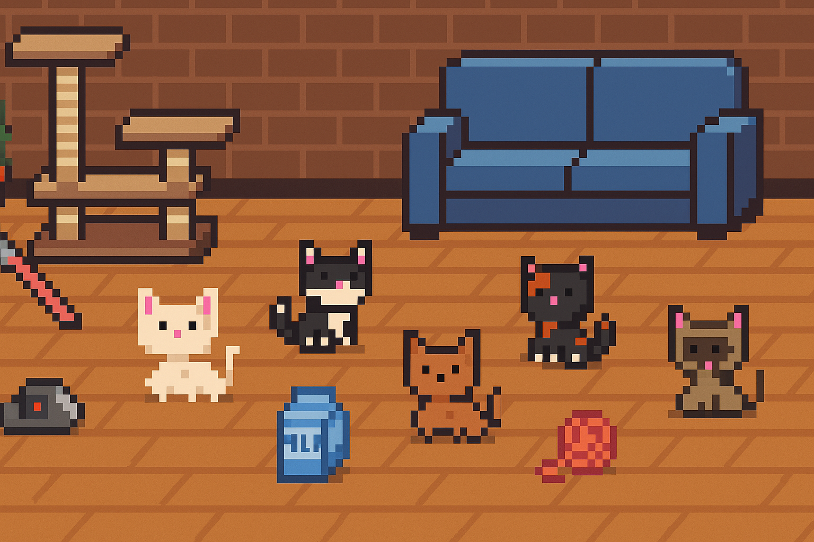

# Cats Couch Clash

A web-based game built with PHP and jQuery, about cats fighting over a couch.

---

## Features

- **Backend:** PHP handles game logic, data processing, and state management.  
- **Frontend:** Uses jQuery for DOM manipulation, AJAX calls, and event handling.  
- **AJAX-powered:** Smooth asynchronous updates (e.g., user actions, game status) via `$.getJSON`, `$.ajax`. 

---

## How It Works

### Frontend (game.js):

Runs $(document).ready(...) on load.

Listens for user actions (clicks, input, etc.).

Sends AJAX requests via $.getJSON or $.ajax to PHP endpoints.

Updates UI dynamically (e.g. scores, game board).

### PHP Backend (game_logic.php):

Receives AJAX requests.

Processes game moves and logic.

Returns JSON responses.

Handles data persistence (optional database or session).

---

## Setup & Requirements

   - PHP 7.4+  
   - A web server (Apache, Nginx, etc.)
   - Browser

Extract repository in correct webserver folder, for XAMPP it is ../xampp/htdocs/
Connect to the following adress using your browser of choice: http://localhost/webprogramming-final-project/index.php
Or use :"your IPV4 Adress"/webprogramming-final-project/index.php to connect from another device.

---

## Project Structure

webprogramming-final-project/ 
├── css/ 
│ └── main.css 
├── data/ # For saving session or state data 
├── images/ # Game assets (cats, mice, couch, etc.) 
│ ├── background.png 
│ ├── CCC_logo.png 
│ ├── couch.png 
│ ├── lamp.png 
│ ├── laserpointer.png 
│ ├── Milk.png 
│ ├── mine.png 
│ ├── mouse.png 
│ ├── plant.png 
│ ├── tile01_white.png 
│ ├── tile02_tuxedo.png 
│ ├── tile03_ginger.png 
│ ├── tile04_tabby.png 
│ ├── tile05_siamese.png 
│ ├── wooden_plank.png 
│ └── wool.png 
├── js/ 
│ ├── game.js # Main gameplay logic 
│ ├── index.js # Lobby/start screen logic 
│ └── skin_carousel.js # UI for choosing player skins 
├── php/ 
│ ├── assign_player.php # Assigns a player to a session 
│ ├── load_state.php # Loads the game state 
│ ├── reset_game.php # Resets the current game session and deletes session data 
│ ├── save_players.php # Saves player details 
│ ├── save_state.php # Saves turn data and moves 
│ ├── start_game.php # Initializes game state 
│ └── use_powerup.php # Handles item/power-up usage 
├── templates/ 
├── game.php # Main game screen 
└── index.php # Landing page / start menu 

---

## Creators

- Anko van Dijk
- Marilie Spooren
- Iwan Hofstra
- Wolter Bos
